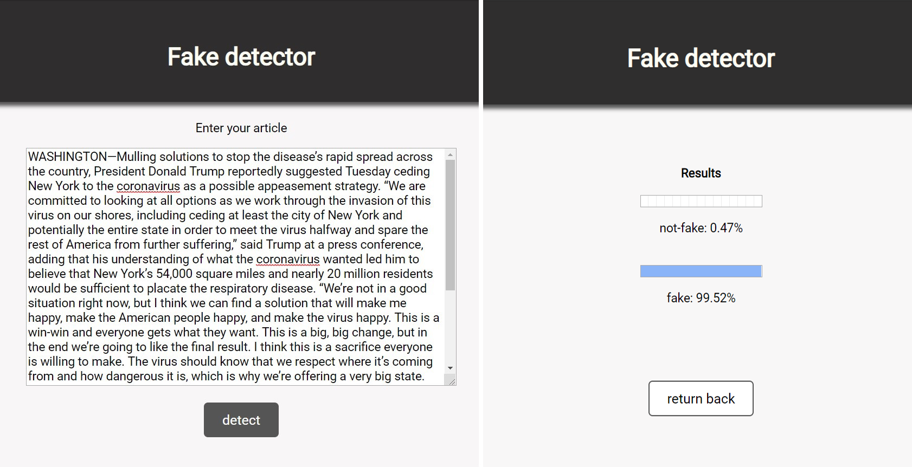

# Fake-Detector
 A fine-tuning BERT model for detect and to binary classify fake news articles.
 
 
## Getting Started
This release tries to classify fake news in *fake* or *not-fake* (binary classification) in a simple web app (Fake-Detector) with micro-framework Flask. It use [BERT](https://github.com/google-research/bert) (Google) as pre-training model and It has been fine-tuned in a specific model, implemented by two different dataset ([AG News](https://s3.amazonaws.com/fast-ai-nlp/ag_news_csv.tgz) and [fake](https://www.kaggle.com/mrisdal/fake-news/)). It has achieved an 0,99 accuracy in test set and exploited this accuracy result to this binary article classification.


### Prerequisites
First needs to install this requirements:
* torch
* numpy
* flask
* Jinja2

After that, you must get *secret_key* for Flask session and change it at **line 12** in *app.py* file. Then, you must simple run with:
```
python app.py
```
After that, you could see different "*FutureWarning: Passing (type,1) ...*" caused by a version of *numpy*. You can simply ignore that. Finally you will see **Fake-Detector** to classify a text of article with a score for a *fake*  or *not-fake*.
Below you can see a demo image of homepage and an examples score about an The Onion article.
<br/>



## Built With
* [`BERT-Base, Multilingual Cased (New, recommended)`](https://storage.googleapis.com/bert_models/2018_11_23/multi_cased_L-12_H-768_A-12.zip), which include different language support (104 languages) with 12-layer, 768-hidden, 12-heads, 110M parameters.
